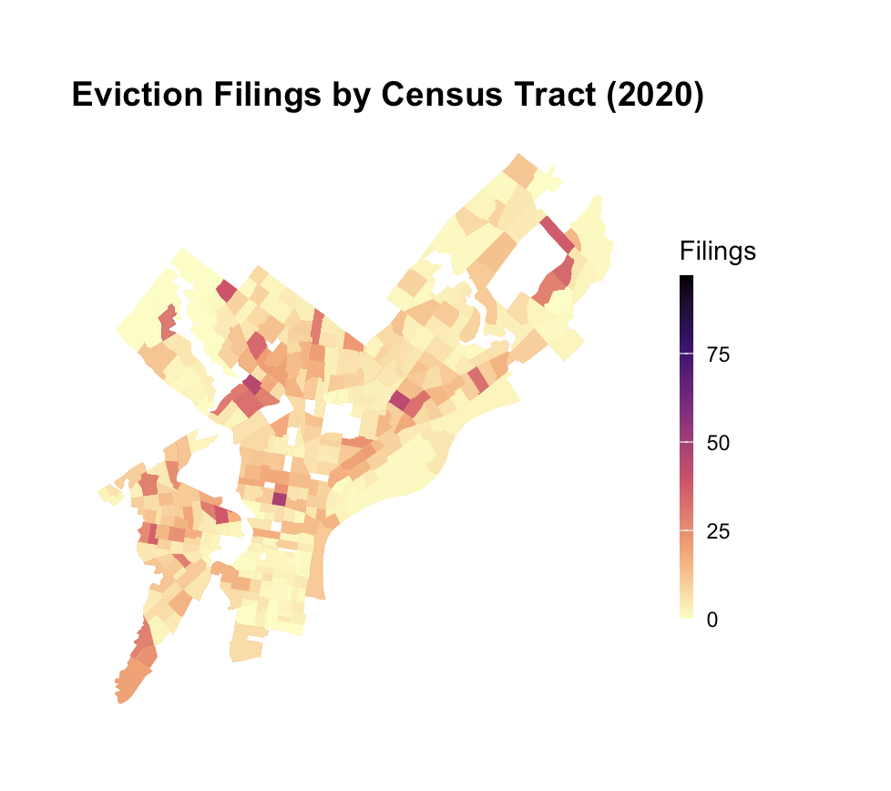
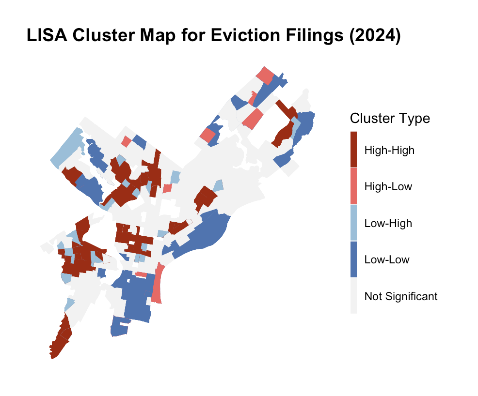
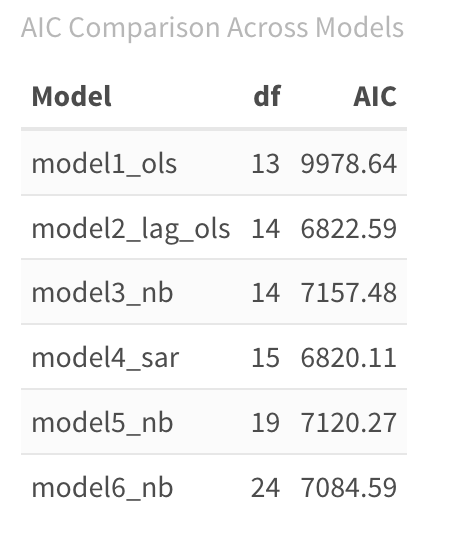
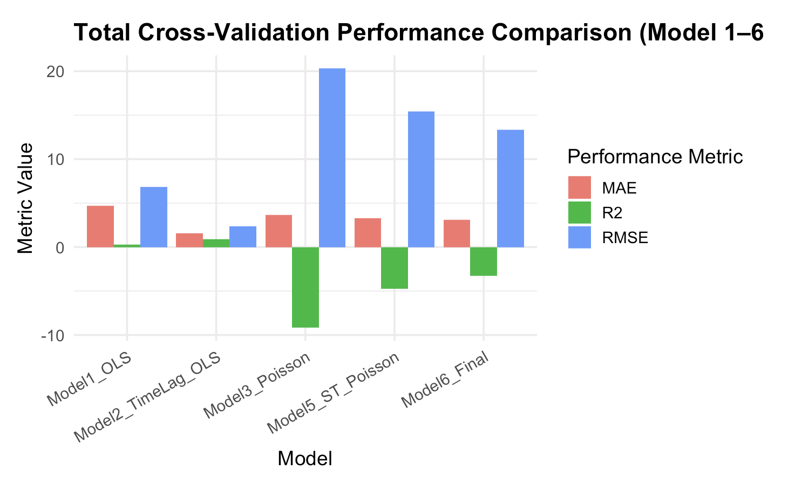
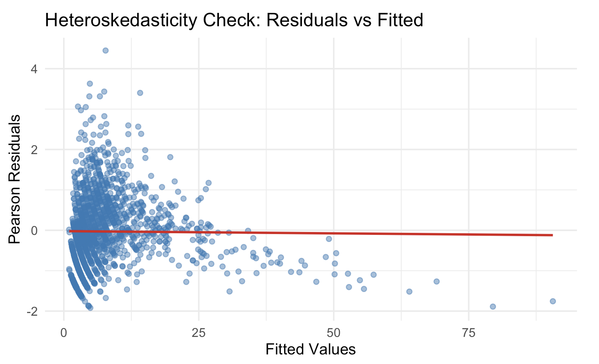
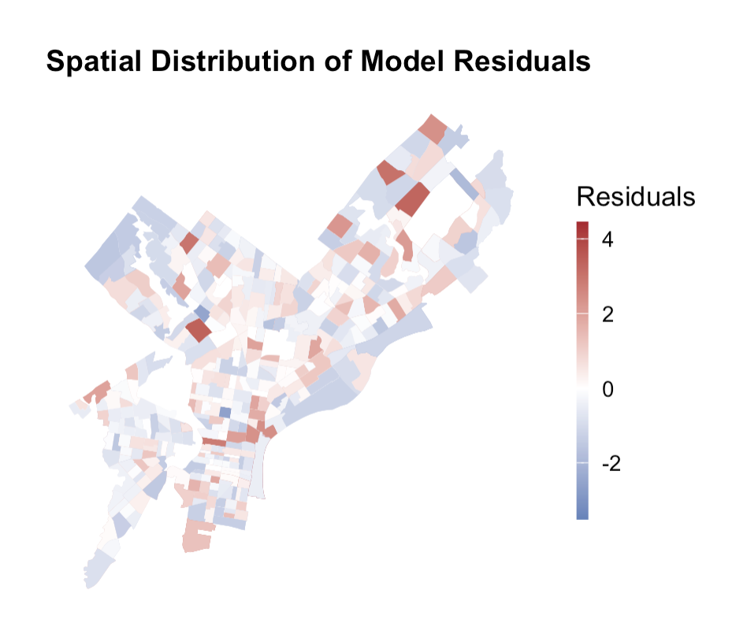

---

### Introduction

Evictions represent a critical indicator of neighborhood instability and social vulnerability.  

In this project, our **dependent variable** is **Quarterly eviction total for 2024, aggregated at the census tract level in Philadelphia.**

---

### Research Question

Our core research question is: **Can we predict quarterly eviction filing counts at the census-tract level 1–3 months (i.e., 1 quarter) in advance, enabling the City of Philadelphia to proactively deploy rental assistance, legal aid resources, and community outreach?**

Including basic concepts as follows:

- Spatial Unit: Census tract
- Temporal Unit: Quarterly
- Outcome: Number of eviction filings per tract per quarter
- Model: Poisson / Negative Binomial (count outcome), Spatial Model, OLS Model

---

### Data Sources

- **ACS (2022):pct_black, median_income, pct_renter, pct_rent_burdened, median_rent, property_age** 
- **Eviction filings (2020–2024) by census tract**
- **OPA property data: median market value, tax delinquency, low value properties**
- **Crime incidents (spatial join to tracts)**
- **Transit stops: number within 800m**
- **2024 quarterly lag variables**

---

### Exploratory Data Analysis

{fig-align="center"}

## 
{fig-align="center"}

---

### Model Building

**Build models progressively:**

**Model 1:** Model 1 — Baseline OLS (Cross-sectional)
- Evict_2024 ~ ACS + property + spatial

**Model 2:** Model 2 — Time-lagged OLS  
- Evict_2024 ~ Time lag + ACS + property + spatial

**Model 3:** Count Data Models (Poisson)
- NB(Evict_2024) ~ Time lag + ACS + property + spatial 

**Model 4:** Spatial Lag Models (SAR / SLX)
- SLX: Evict_2024 ~ Time lag + X + W * X
- SAR: Evict_2024 = ρ (W * Evict_2024) + βX + ε

**Model 5:** Poisson+spatial lag
- Evict_2024 = TimeLag_i + X_i + W * X_i

**Model 6:** fixing spatial autocorrelation
- Evict_2024 ~ TimeLag + X_i + W * X_i + eig1 + eig2 + eig3 + ...

----

### Comparison table

{fig-align="center"}

---

{fig-align="center"}

---

### Model 6 - Final Model

- It incorporates spatial eigenvectors to absorb unmeasured spatial patterns. Instead of adding spatially lagged predictors, this model adds a few eigenvectors (eig1, eig2, eig3…) that represent broad spatial structure. This helps reduce spatial autocorrelation in residuals and improves model stability. Fix remaining spatial autocorrelation by adding Moran’s Eigenvector (ME) terms to Model 5.

- ME terms successfully remove spatial dependence in residuals. And AIC decreases further, showing best-performing model overall.

- In this model, coefficients become more stable and interpretable, and satisfies temporal, spatial, and distributional assumptions simultaneously.

---

### Residual Diagnostics

{fig-align="center"}
---

## Residual Diagnostics 

{fig-align="center"}

---

### Model Limitations and Next Steps

**Key Limitations**

- Reporting bias: Not all eviction threats are filed legally

- Structural racism embedded in variables 

- Spatial autocorrelation: Even with SAR/NB, hotspots persist

- Data missingness: Some tracts have incomplete filings

- Temporal mismatch: ACS (2022) vs eviction filings (2024)

**Who could be harmed?**

- Predictive policing–like biases if misused

- Reinforcing stereotypes about neighborhoods

- Misallocation of city resources if model error is high in low-income tracts

**Next Steps**

- Consider **other spatial features** to help magnify spatial patterns 
- Extend analysis with **temporal dimension** (panel data) to capture price dynamics over time.

---

### Policy Recommendations

  - Risk of encoding structural inequalities from historical disinvestment
  
  - Use model uncertainty to prevent over-targeting

  - Integrate with 311 and landlord registries for better predictive power

---

### Conclusion 

- Spatial methods significantly improve accuracy

- Should be used for resource allocation, not punitive action

- Future development: incorporate landlord behavior, zoning, rental registry data, and more granular time series 

---

## Thank you for listening  
**Any questions?**

---